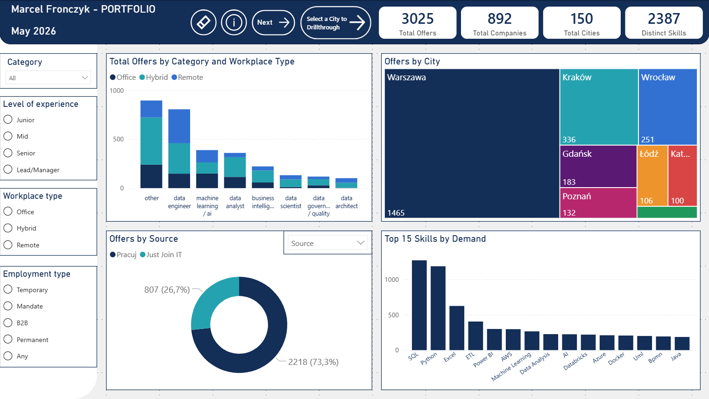
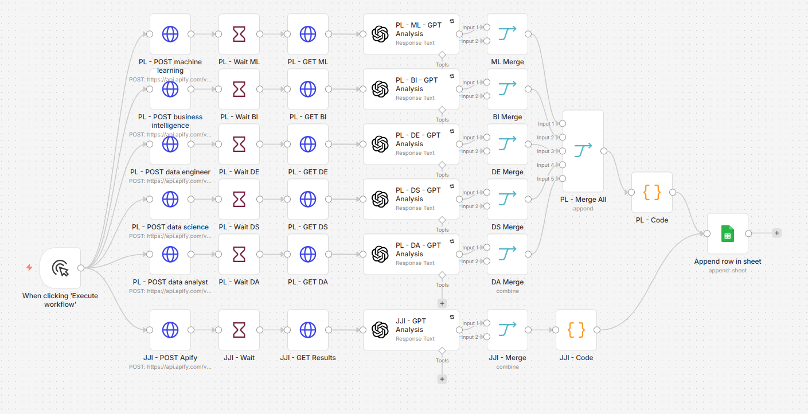
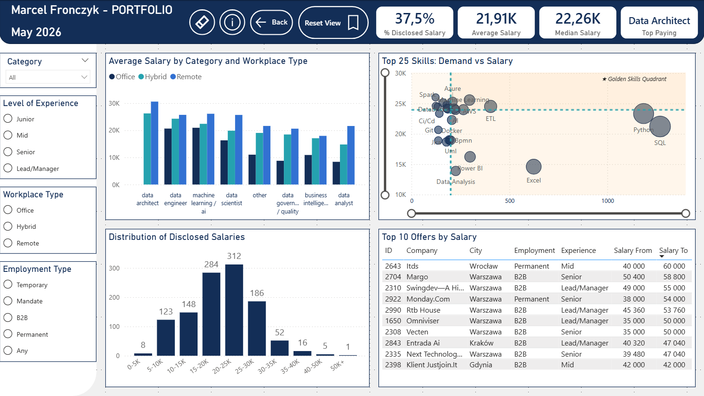
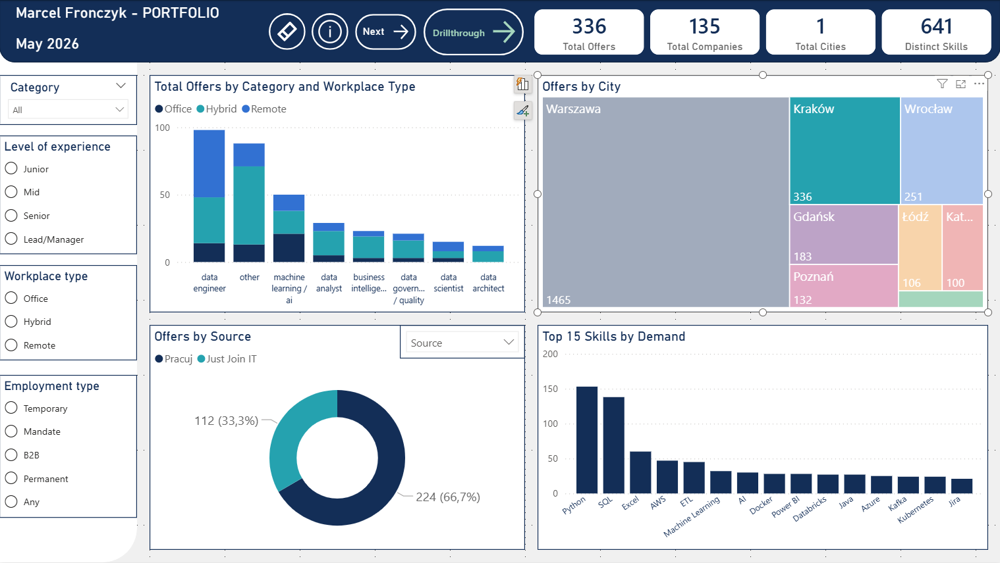
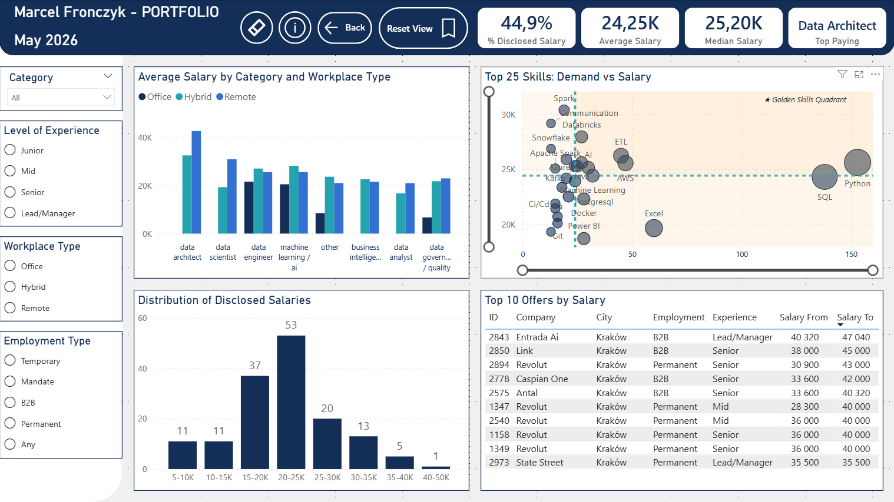
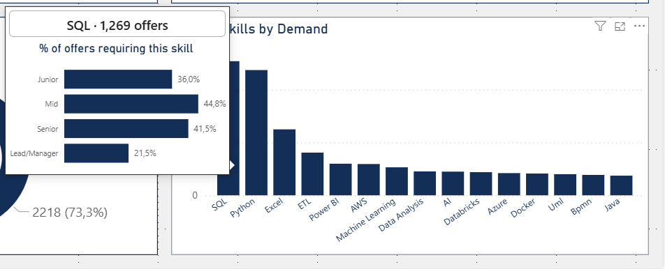

# AI-Powered Job Market Intelligence
 
> End-to-end pipeline analyzing 3,025 Polish data job offers — automated scraping, AI classification, and an interactive analytics dashboard.
 

 
## Overview
 
A data engineering and analytics portfolio project answering one question: **what does the Polish data job market actually look like in 2026?**
 
The project combines automated web scraping, LLM-based classification, and interactive business intelligence to surface insights about role distribution, salary patterns, geographic concentration, and skills strategy — across 3,025 offers from Poland's two largest tech job boards.
 
Built end-to-end: data acquisition → cleaning → modeling → analytics → interactive dashboard. Each layer is reproducible and the entire pipeline auto-refreshes when new scrapes append rows to the source.
 
## Architecture
 

 
n8n orchestrates the entire workflow: triggers Apify scrapers (one per category for Pracuj.pl, single endpoint for JustJoin.it), routes each scraped offer through GPT-4o-mini for skills and category extraction, then appends structured results to Google Sheets. Power BI connects to Sheets as a live data source — new scrapes automatically flow through Power Query transformations into the dashboard on refresh.
 

 
## Pipeline Details
 
### 1. Data Acquisition (Apify)
 
- **Sources**: JustJoin.it · Pracuj.pl
- **Volume**: 3,025 unique offers after deduplication
- **Diversity**: 892 distinct companies, 150 cities, 2,387 distinct skills
- **Pracuj.pl strategy**: separate scraping branches per data role category (analyst, engineer, BI, ML/AI, etc.) for better coverage of niche segments
- **JustJoin.it strategy**: single endpoint returning structured data per offer
### 2. AI Classification (GPT-4o-mini)
 
Single-pass extraction per offer:
 
- **Skills extraction**: normalized to English, with inference fallback from job title and requirements when explicit skills aren't listed
- **Category assignment**: one of 8 data roles (Data Analyst, Data Scientist, BI, ML/AI, Data Engineer, Data Governance/Quality, Data Architect, Other)
- **Relevance filtering**: GPT flags non-data roles (sales, physical work, unrelated fields) for downstream removal — prevents noise from reaching analytics
- **Structured output**: JSON with enforced schema (`{skills: [...], category: "..."}`)
**Extraction success rate: 99.1%** — 2,999 of 3,025 offers have at least one extracted skill. The 26 failures (~0.9%) come primarily from sparse job descriptions where neither explicit skills nor title-based inference yielded results. Conscious decision NOT to force placeholder skills — preserves data integrity over cosmetic completeness.
 
### 3. Live Storage (Google Sheets)
 
Sheets serves as the staging layer between n8n pipeline and Power BI. New scrape runs append rows; Power BI's web connector reads via published CSV URL. Together this creates a closed-loop auto-refresh: scrape → append → Power Query → dashboard.
 
### 4. Data Engineering (Power Query)
 
The Power Query stack handles real-world data messiness:
 
- **Polish → English normalization**: workplace types (`Praca hybrydowa` → `Hybrid`), employment types (`Umowa o pracę` → `Permanent`), experience levels (13 raw values consolidated into 4: Junior / Mid / Senior / Lead-Manager), city name variants (`Warsaw` → `Warszawa`)
- **10-step company name entity resolution**: handles 30+ legal form variants (`Sp. z o.o.`, `Spółka Z O. O.`, `Sp.Z.O.O.`, ...) → unified format, plus brand consolidation (PKO Bank Polski, AXA, BNP Paribas)
- **Two-stage deduplication**: by link first (technical re-scrape dupes), then by title × city × company (cross-posted offers between platforms)
- **Gender marker stripping**: removes Polish convention `(K/M/X)`, `[K/M]`, `| K/M/D` patterns from job titles via static list of ~50 variants
- **Salary format auto-detection**: classifies offers as Hourly/Daily/Monthly/Yearly based on Salary From magnitude (`<500` = Hourly, `<2000` = Daily, `<100000` = Monthly, `≥100000` = Yearly), normalizes all to monthly PLN
- **Outlier filter**: removes offers where `salary_to > 20 × salary_from` (anomalies from mixed-unit ranges, e.g., hourly From with monthly To)
Full Power Query M code: [`powerquery/offers.m`](powerquery/offers.m) (main fact table), [`powerquery/offerskills.m`](powerquery/offerskills.m) (bridge to skills dimension).
 
### 5. Analytics (Power BI)
 
Two-page interactive dashboard with star schema (Offers fact table + OfferSkills bridge), custom tooltip pages, drillthrough navigation, and bookmark-driven info panels. Custom DAX measures handle bridge-table filter propagation via `CROSSFILTER` for skill-level salary analysis.
 
## Power BI Dashboard
 
### Page 1 — Market Overview
 

 
**KPIs**: Total Offers · Total Companies · Total Cities · Distinct Skills
 
**Main visualizations**:
 
- **Total Offers by Category and Workplace Type** — stacked bar revealing role distribution and remote / hybrid / office mix
- **Offers by City** — treemap showing geographic concentration (Warsaw 48% dominant)
- **Offers by Source** — dynamic donut switchable via Field Parameter to slice by Source / Workplace Type / Experience Level
- **Top 15 Skills by Demand** — sorted bar chart of most-required skills across all offers
### Page 2 — Salary Analysis
 

 
**KPIs**: % Disclosed Salary · Average Salary · Median Salary · Top Paying Category — frames the salary transparency narrative.
 
**Main visualizations**:
 
- **Average Salary by Category and Workplace Type** — clustered bar revealing category premiums and remote pay differential
- **Top 25 Skills: Demand vs Salary** — scatter chart with median-line quadrants highlighting "Golden Skills" (high demand × high pay)
- **Distribution of Disclosed Salaries** — histogram with 5K bins showing market salary structure
- **Top 10 Offers by Salary** — table of highest-paying disclosed offers
### Interactive Features
 
**Multi-level treemap interaction hierarchy** on `Offers by City`:

- **Hover** → custom tooltip preview (lightweight)
- **Click** → cross-filter rest of Page 1; "Drillthrough" button activates
- **Right-click** → "Select a City to Drillthrough" → committed deep-dive to Page 2




 
**Custom tooltip pages** (three total):
 
| Tooltip | Source visual | Metric | Content |
|---------|--------------|--------|---------|
| **City profile** | Treemap | Counts | `Warszawa · 1,465 offers` + stacked bar: experience × workplace breakdown |
| **Skill prevalence** | Top Skills bar | Percentages | `SQL · 1,269 offers` + bar chart: % of offers at each seniority level requiring this skill |
| **Salary trajectory** | Skills Strategy scatter | Ranges | `Python · Salary by Seniority` + floating bars: Avg Salary From → Avg Salary To per experience level |
 
Different metric per question type, by design:
 
- **City tooltip uses counts** — answers *"where are the jobs?"*
- **Skill tooltip uses percentages** — answers *"how prevalent is this skill at each level?"*  
- **Scatter tooltip uses ranges** — answers *"what salary can I realistically expect with this skill at my level?"*

 
**Bookmark-driven info textbox toggle**: each page has an `(i)` button that swaps the main category bar chart for a project info panel covering pipeline architecture, observations, and methodology. Re-clicking the same button restores the chart.
 
**Navigation buttons** in dashboard header:
 
- Reset Slicers (native action — no bookmark maintenance)
- Info toggle (bookmark-driven show/hide)
- Page navigation (Next / Back)
- "Select a City to Drillthrough" trigger button (becomes active only when a city is selected in treemap)
## Key Insights
 
### Market Structure (Page 1)
 
- **Warsaw dominates**: alone holds 48% of all offers; top 3 cities (Warsaw, Kraków, Wrocław) account for 68% of the market
- **Source asymmetry**: Pracuj.pl (73%) outscales JustJoin.it (27%) — different audiences captured by each platform
- **"Other" category is largest** (~30%) — real-world classification mess preserved as a data quality disclaimer rather than force-classified
- **Universal skills**: SQL, Python, and Excel dominate demand across all categories
### Compensation Patterns (Page 2)
 
- **Salary transparency lags**: only 37.5% of offers disclose salary — Polish market still trails EU Pay Transparency Directive expectations
- **Symmetric distribution**: mean (21.9K) ≈ median (22.3K), no extreme right tail
- **Data Architect commands top pay**; **Remote roles** earn ~15-20% premium over Office equivalents
- **Skills strategy**: Python & SQL are universal must-haves but NOT premium differentiators — Cloud (AWS, Azure) + Big Data (Spark, Snowflake, Databricks) drive premium pay; Excel & Power BI sit in the commodity quadrant
- **Top-paying offers (50-60K)**: all Senior+ / Lead level, all B2B contracts, concentrated in Warsaw, Kraków, Wrocław
## Methodology & Limitations
 
### Data Quality Transparency
 
- **Skill extraction success rate: 99.1%** (2,999 of 3,025 offers). 26 offers (~0.9%) failed primarily due to sparse descriptions where neither explicit skills nor GPT title-based inference yielded results. Documented rather than masked.
- **Salary analysis based on 37.5% disclosed sample**. Subset scope flagged via KPI header on Page 2.
- **Sample size caveat**: niche skill × Lead/Manager combinations in the Skills Strategy scatter tooltip can show noisy salary averages (n=5-10 disclosed offers per cell). Accepted as transparent limitation rather than filtered cosmetically.
### Conscious Design Decisions
 
- **"Other" category retained at ~30%** rather than force-fitting offers into adjacent categories. Better to surface a classification limitation than introduce false signal.
- **Tooltip metrics vary by question**: counts for city tooltip (volume question), percentages for skill prevalence (penetration question), salary ranges for scatter (expectations question). Consistent metric would be visually tidier but analytically weaker.
- **Quadrant shading via stacked reference-line `shade-area`** rather than static rectangle overlay. Reference-line shading is data-bound and follows median lines under filters and zoom; rectangle overlay would drift relative to dynamic medians.
- **DAX bridge filter handling**: skill-level salary measures use `CROSSFILTER(BOTH)` locally rather than enabling bidirectional cross-filter globally on the Offers ↔ OfferSkills relationship. Avoids ambiguity loops in case future relationships are added.
### Limitations
 
- **Snapshot in time** (May 2026); market conditions evolve, especially around EU Pay Transparency Directive enforcement (June 2026)
- **Gross vs net salary** indistinguishable in source — Permanent contracts typically gross, B2B typically net, but no explicit indicator from portals
- **Two-source bias** (Pracuj.pl + JustJoin.it) — doesn't capture LinkedIn, Bulldogjob, NoFluffJobs, internal company portals
- **Workplace mix similar across cities** (hybrid-dominant nearly everywhere) — limited cross-city geographic differentiation on workplace dimension
## Repository Structure
 
```
ai-job-market-intelligence/
├── README.md
├── LICENSE
├── workflow.json              # n8n workflow export (credentials redacted)
├── dashboard.pbix             # Power BI dashboard file
├── powerquery/
│   ├── offers.m              # Offers fact table M code
│   └── offerskills.m         # OfferSkills bridge M code
└── images/
    ├── page1_offers.png
    ├── page2_salary.png
    ├── tooltip_city.png
    ├── tooltip_skill_prevalence.png
    ├── tooltip_salary_range.png
    ├── drillthrough_krakow.png
    ├── info_textbox.png
    └── n8n_workflow.png
```
 
## How to Reproduce
 
### View the Dashboard
 
1. Clone or download this repository
2. Install [Power BI Desktop](https://www.microsoft.com/en-us/download/details.aspx?id=58494) (free, Windows only)
3. Open `dashboard.pbix` — dashboard renders with embedded data snapshot
4. Optional refresh: requires Google Sheets connection setup via *Transform data → Data source settings*
### Reproduce the Pipeline
 
1. Set up [n8n](https://n8n.io) instance (cloud or self-hosted)
2. Import `workflow.json` via n8n's Import feature
3. Configure credentials (originals redacted on export):
   - **Apify** API token (for actor execution)
   - **OpenAI** API key (for GPT-4o-mini calls)
   - **Google Sheets** OAuth or service account
4. Configure Sheets destination: spreadsheet ID and target tab
5. Execute workflow manually or attach Schedule trigger for automation
### Power Query Code Inspection
 
For data engineering review without Power BI Desktop: M code is exported to `powerquery/` as plain text. Read Offers transformations in [`offers.m`](powerquery/offers.m), bridge table logic in [`offerskills.m`](powerquery/offerskills.m).
 
## Future Work
 
- **v2 classification prompt**: minimize "Other" category through more rigorous role taxonomy with few-shot examples
- **Skill family clustering**: group skills into Programming Languages / Cloud / BI / Big Data / Workflow / Soft Skills — would unlock additional color encoding in the Skills Strategy scatter
- **Time-series view**: scheduled monthly scrapes building a longitudinal dataset tracking salary trends and skill demand evolution
- **Multi-source expansion**: LinkedIn Jobs, Bulldogjob, NoFluffJobs, individual company career pages
- **Salary transparency longitudinal study**: track disclosure rate evolution post EU Pay Transparency Directive enforcement
- **Native salary unit detection**: extract gross/net indicator from offer text via additional GPT classification pass
## Tech Stack
 
- **Orchestration**: n8n
- **Scraping**: Apify
- **AI**: OpenAI GPT-4o-mini
- **Storage**: Google Sheets (live connection)
- **ETL**: Power Query (M language)
- **Analytics**: Power BI (DAX measures, custom visuals, bookmarks, drillthrough)
## Author
 
**Marcel Fronczyk** — Corporate Finance consultant exploring data-focused roles.
 
- GitHub: [@marcelFRO](https://github.com/marcelFRO)
---
 
*This project is licensed under the MIT License — see [LICENSE](LICENSE) for details.*
